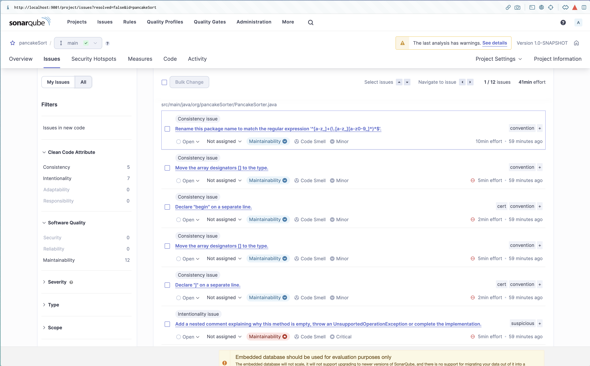

## Student Information

First Name: Joël

Last Name: Mik

Student number: Replace-this-with-your-student-number

## Assignment 

### 1. Git log

```
05dc95dx 2023-09-18     Update: Changed the test class to use assertArrayEquals
510d41bx 2023-09-18     Feat: Added @BeforeEach to the test class
d6b32b0x 2023-09-16     Feat: Added tests using TDD
894ac8ex 2023-09-16     Added README.md
```
#### Committed the sort function together with the Update of the test class.

### 2. Sonarqube

A dated screenshot of the overview of the following  quality gates(https://docs.sonarqube.org/latest/user-guide/quality-gates/): Reliability, Security,Maintainability, Coverage and Duplications. Provide a short discussion of the results.


Most of the quality gates are about maintanability of the Sort function. The function is not very readable according to Sonarqube. Also, inside the test class there is no need for the 'public' modifier.
  

### 3. Test Driven Development

Your best test class code snippets with a rationale why the unit tests are “good” tests.  Provide a link to the Test class and the class under test in Git.

Answer: The first test tests if the function works when the list is already sorted. The second test tests if the function works when the list is unsorted. The third test tests if the function works when the list is in reverse order. The tests are good because they test the different cases of the function.

```java
@Test
public void testSortedList() {
        assertArrayEquals(new int[]{1, 2, 3, 4, 5}, pancakeSorter.sort(new int[]{1, 2, 3, 4, 5}, 5));
        }

@Test
public void testUnsortedList() {
        assertArrayEquals(new int[]{1, 2, 3, 4, 5}, pancakeSorter.sort(new int[]{3, 4, 2, 1, 5}, 5));
        }

@Test
public void testReverseOrderList() {
        assertArrayEquals(new int[]{1, 2, 3, 4, 5}, pancakeSorter.sort(new int[]{5, 4, 3, 2, 1}, 5));
        }
```

[link-to-your-class-under-test](/src/main/java/org/pancakeSorter/PancakeSorter.java)

[link-to-your-test-class](/src/test/java/PancakeSorterTest.java)

### 4. Code Reviews

Screenshots of the code reviews you have performed on code of another student as comments in Gitlab: Provide a link to the comments in Gitlab.

 

[link-to-comments-you-gave](/somerepo/path-to-file)

